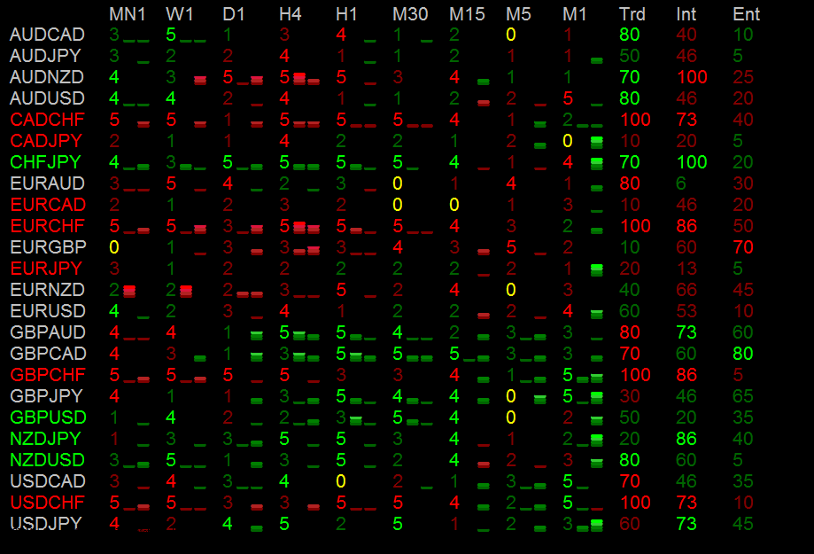

IchiBalls Indicator
===================

The reason I wrote the Ichiballs indicator was I struggling to try to watch all the pairs at once. It always seemed that while I was stalking one pair there was always some other pair was moving much better. So I wrote an indicator (which I affectionately call IchiBalls) to watch all the pairs and score each timeframe related to aspects of Ichi signals. Each timeframe is score from 0 to 5... Red being bearish and green being bullish. The scores at the end percentages based on aggregates of groups of timeframes. Also, you'll notice the little bars next to the timeframe scores; the first is based on RSI and the second is based on CCI.

The scoring works like this:

<b>Price vs. TK/KS: -1/0/+1</b> 
Price vs. Kumo: -1/0/+1 
TS vs. KS: -1/+1 
SpanA vs. SpanB: -1/+1 
CS vs. Price[26]: -1/+1 

<b>For the Aggregate Scores:</b> 
Trend (Trd): 1-100 score based on Monthly and Weekly 
Intraday(Int): 1-100 score based on Daily, 4 Hour, and 1 Hour 
Entry(Ent): 1-100 Score based on 30 Minute, 15 Minute, 5 Minute and 1 Minute. 

You will have to install the attached font is you want the RSI and CCI bars to work. And you will have to create a terminal window with every value set to "none" for color. Also, there is option for pair name prefix and suffixes if your broker uses them. I have this running on MBT Trading, FXCM and CitiPro and am not having issues.

